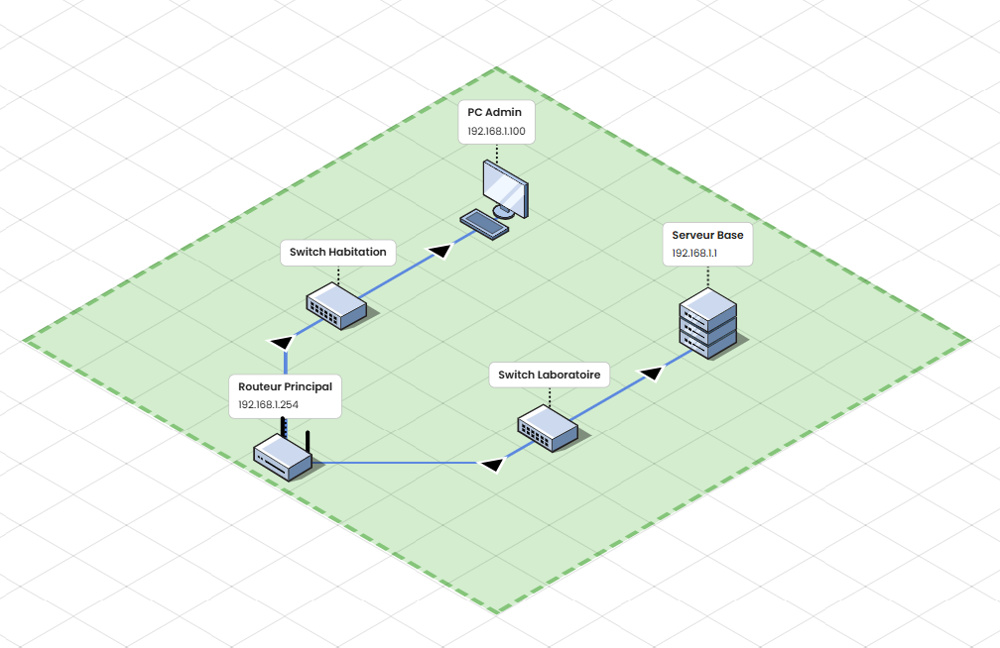

# 🚀 Mission 001 — Installation de la Base sur Eldarion

## 📖 Contexte

Bienvenue sur la planète **Eldarion**, première colonie intergalactique.

Avant de lancer les opérations avancées, la colonie a besoin d'une **infrastructure réseau stable** permettant aux systèmes de communiquer.

Votre mission : construire le **premier réseau opérationnel de la base**.

---

## 🎯 Objectif technique

Créer un laboratoire réseau simulé permettant de :

- connecter plusieurs machines
- tester la connectivité réseau
- préparer les futures missions DevOps

Technologies utilisées :

- GNS3
- Linux
- Python

---

## 🛰 Topologie

Routeur Principal 
│  
├── Switch Habitation → PC Admin  
│  
└── Switch Laboratoire → Serveur Base  

Adresse IP utilisées :

| Machine | IP |
|------|------|
| Routeur Principal | 192.168.1.254 |
| PC Admin | 192.168.1.100 |
| Serveur Base | 192.168.1.1 |

---
Schéma Réseau : 



## ⚙️ Configuration

Tests de connectivité :

ping 192.168.1.254
ping 192.168.1.1


## 🧠 Script de monitoring réseau

Script Python permettant de vérifier la connectivité de la base.

```python
import os

hosts = ["192.168.1.10", "192.168.1.1"]

for host in hosts:
    response = os.system(f"ping -c 1 {host}")
    if response == 0:
        print(f"{host} est joignable")
    else:

        print(f"{host} est INJOIGNABLE")

